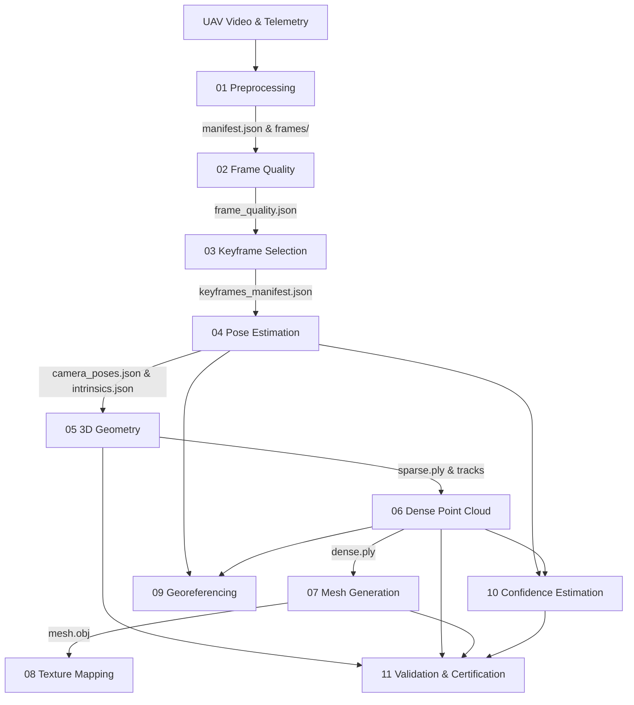

# UAV Single-Pass 3D Reconstruction Platform

A production-grade, modular photogrammetric and computer vision platform engineered to transform raw continuous UAV flight video and companion telemetry into georeferenced metric 3D point clouds, textured surface meshes, and certified quality reports.

---

## Key Capabilities

1. **Zero Mock/Fake Results**: Every reconstruction module implements genuine computer vision, photogrammetric, and computational geometry algorithms using OpenCV, NumPy, SciPy, and standard 3D formats (ASCII/binary PLY, Wavefront OBJ/MTL).
2. **11 Independently Callable Modules**: Each stage operates as an isolated execution unit with explicit Pydantic input/output contracts. Any stage can be invoked directly through the REST API or CLI.
3. **Atomic Resumption Engine**: Every stage writes intermediate artifacts and a structured `checkpoint.json`. If a downstream stage fails (or parameters are adjusted), the pipeline resumes directly from the failed checkpoint without restarting earlier computations.
4. **Hardware Acceleration Layer**: Automatic hardware detection interrogates PyTorch CUDA runtimes and GPU VRAM availability. Supports configurable execution modes (`auto`, `cuda`, `cpu`) with automatic multi-threaded CPU fallback.
5. **Decoupled Architecture**: High-performance FastAPI Python backend paired with a modern React + Three.js web application for interactive 3D digital twin navigation, camera frustum trajectory inspection, and quality compliance reporting.

---

## Architectural Workflow & Module Connectivity

The reconstruction pipeline is structured as a directed acyclic execution graph (DAG) composed of 11 sequential photogrammetric modules:



### Module Connections & Data Contracts

| Stage | Name | Input Contract Artifacts | Output Contract Artifacts | Algorithmic Core |
|---|---|---|---|---|
| **01** | `preprocessing` | Raw video (`.mp4`, `.mov`, `.avi`) | `frames/`, `manifest.json` | Uniform FPS sampling, resolution downscaling, perceptual CLAHE contrast equalization. |
| **02** | `frame_quality` | `manifest.json`, `frames/` | `frame_quality.json` | Per-frame Laplacian variance sharpness ($Var(\Delta I)$), mean luminance, contrast standard deviation. |
| **03** | `keyframe_selection` | `frame_quality.json`, `frames/` | `keyframes/`, `keyframes_manifest.json` | Dense Farneback optical flow inter-frame baseline displacement filtering and sharpness ranking. |
| **04** | `pose_estimation` | `keyframes_manifest.json`, camera optics | `camera_poses.json`, `camera_intrinsics.json` | SIFT/ORB feature extraction, FLANN/BF ratio testing, Essential Matrix $E$ via RANSAC, 6-DoF trajectory $(R, t)$. |
| **05** | `geometry` | `camera_poses.json`, `camera_intrinsics.json` | `sparse.ply`, `sparse_metadata.json` | Two-view & multi-view linear triangulation ($P = K[R \mid t]$), chirality verification, reprojection residual filtering. |
| **06** | `dense_point_cloud` | `camera_poses.json`, `sparse.ply` | `dense.ply`, `dense_metadata.json` | Semi-Global Block Matching (StereoSGBM) disparity fields, metric depth reprojection, spatial voxel grid filtering. |
| **07** | `mesh_generation` | `dense.ply` or `sparse.ply` | `mesh.obj`, `mesh_metadata.json` | 2.5D Delaunay spatial surface triangulation (TIN), edge-length outlier pruning, vertex normal calculation. |
| **08** | `texture_mapping` | `mesh.obj`, `keyframes/` | `mesh_textured.obj`, `material.mtl`, `texture_atlas.png` | Planar/orthographic UV coordinate generation, texture atlas synthesis, Wavefront MTL material definition. |
| **09** | `georeferencing` | Telemetry GPS track (`.srt`, `.csv`), `camera_poses.json` | `georeference.json` | 7-parameter Helmert / Sim(3) similarity transformation aligning local metric coordinates to WGS84 and EPSG:3857. |
| **10** | `confidence_estimation` | `dense.ply`, `camera_poses.json` | `confidence_cloud.ply`, `confidence_metrics.json` | Multi-view ray intersection parallax angle calculation ($15^\circ - 45^\circ$ optimal window), observation redundancy. |
| **11** | `validation` | Metrics from Stages 01–10 | `quality_report.json` | Photogrammetric engineering certification: Ground Sample Distance (GSD), reprojection error tolerance ($\le 2.5\text{px}$), completeness. |

---

## Directory Structure

```
SIH-001/
├── backend/
│   ├── app/
│   │   ├── api/                     # REST API Routers
│   │   │   ├── missions.py          # Mission CRUD
│   │   │   ├── uploads.py           # Video & telemetry upload endpoints
│   │   │   ├── jobs.py              # Reconstruction job dispatch & resume
│   │   │   ├── stages.py            # Independent standalone stage execution API
│   │   │   ├── results.py           # 3D artifact downloads & quality reports
│   │   │   └── system.py            # GPU/CPU hardware detection & health
│   │   ├── core/                    # Core Infrastructure
│   │   │   ├── config.py            # YAML & Pydantic settings manager
│   │   │   ├── device.py            # GPU/CUDA/VRAM detection & CPU fallback
│   │   │   ├── logging.py           # Structured logging & per-job logs
│   │   │   └── database.py          # SQLite with WAL mode & SQLAlchemy session
│   │   ├── models/                  # SQLAlchemy ORM Models
│   │   ├── schemas/                 # Pydantic v2 Contracts & DTOs
│   │   ├── pipeline/                # 11 Photogrammetry Modules
│   │   │   ├── base.py              # BaseStage abstract class & checkpointing
│   │   │   ├── registry.py          # Dynamic stage discovery & ordering
│   │   │   ├── runner.py            # Resumable PipelineRunner
│   │   │   └── stages/              # Implementation of stages s01 to s11
│   │   ├── services/                # Business logic services
│   │   └── main.py                  # FastAPI Application Entrypoint
│   ├── config/                      # Configuration files
│   │   ├── pipeline_config.yaml     # Thresholds, parameters, and storage paths
│   │   └── logging_config.yaml      # Logging handlers and formatting
│   ├── tests/                       # Complete unit and integration test suite
│   ├── requirements.txt
│   └── run.py                       # Python server launcher
├── frontend/
│   ├── src/
│   │   ├── api/client.js            # Frontend REST client
│   │   ├── components/
│   │   │   ├── Navbar.jsx           # Mission navigation & live hardware monitor
│   │   │   ├── ModelViewer3D.jsx    # Three.js 3D viewer (point clouds & meshes)
│   │   │   ├── StagePipelineView.jsx# Interactive 11-stage execution graph & resume
│   │   │   └── StatusBadge.jsx      # Status pill indicator
│   │   ├── pages/
│   │   │   ├── LandingPage.jsx      # Platform overview & missions list
│   │   │   ├── CreateMissionPage.jsx# UAV flight & optics setup form
│   │   │   ├── VideoUploadPage.jsx  # Drag-and-drop video & telemetry ingestion
│   │   │   ├── ProcessingDashboard.jsx # Real-time job monitor & checkpoint resumption
│   │   │   ├── DigitalTwinViewerPage.jsx # Full-screen 3D digital twin viewer
│   │   │   └── AnalyticsReportPage.jsx   # Photogrammetric quality certification
│   │   ├── App.jsx
│   │   └── index.css                # Aerospace dark-mode glassmorphic theme
│   ├── package.json
│   └── vite.config.js
├── ARCHITECTURE.md                  # Comprehensive technical specification & math
└── README.md
```

---

## Installation & Quick Start

### 1. Backend Setup

Prerequisites: Python 3.10+

```bash
# Navigate to project root
cd SIH-001

# Install backend dependencies
python -m pip install -r backend/requirements.txt

# Run the test suite (validates all 11 stages and contracts)
python -m pytest backend/tests -v

# Start the backend server on port 8000
python backend/run.py
```
*Backend API documentation is available at:* `http://127.0.0.1:8000/docs`

### 2. Frontend Setup

Prerequisites: Node.js v18+

```bash
# Navigate to frontend directory
cd frontend

# Install dependencies (React 18, Three.js, Lucide)
npm install

# Start Vite development server on port 5173
npm run dev
```
*Open your browser at:* `http://localhost:5173`

---

## Resumption & Checkpointing Workflow

Every reconstruction stage writes an atomic `checkpoint.json` inside:
`storage/artifacts/<job_id>/<stage_name>/checkpoint.json`

Example checkpoint structure:
```json
{
  "stage_name": "dense_point_cloud",
  "stage_order": 6,
  "status": "completed",
  "timestamp": "2026-09-03T10:14:12.823Z",
  "execution_time_seconds": 1.42,
  "device": "cpu",
  "artifacts": {
    "dense_ply": "storage/artifacts/<job_id>/dense_point_cloud/dense.ply",
    "dense_metadata": "storage/artifacts/<job_id>/dense_point_cloud/dense_metadata.json"
  },
  "metrics": {
    "dense_points_reconstructed": 42150,
    "voxel_downsample_m": 0.05
  },
  "resumable": true
}
```

To resume execution from a failed or specific stage:
- **Through the UI**: Open the Processing Dashboard, click on any stage in the interactive DAG, and hit **"Resume From Stage N"**.
- **Through the API**: Send `POST /api/v1/jobs/<job_id>/resume?from_stage=mesh_generation`. Earlier stages will be loaded directly from their saved disk checkpoints without recomputation.

---

## Future Phase Integration Guide

This foundation is designed to allow future drop-in enhancements without refactoring the architecture:
- **Stage 04 (Pose Estimation)**: Can integrate COLMAP / PyCOLMAP or learned deep feature matchers (SuperPoint + LightGlue) by implementing the `PoseEstimationStage.execute()` contract.
- **Stage 06 (Dense Point Cloud)**: Can switch from StereoSGBM to Neural Radiance Fields (NeRF) or 3D Gaussian Splatting (3DGS) while maintaining the `dense.ply` export contract.
- **Stage 07 (Mesh Generation)**: Can switch from 2.5D Delaunay to Screened Poisson Surface Reconstruction or Marching Cubes by modifying only `s07_mesh_generation.py`.
